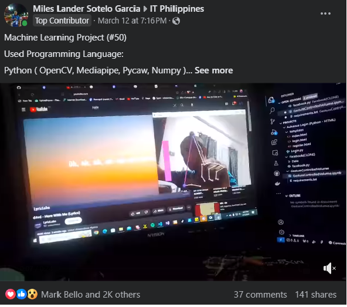

# Miles Garcia - Professional Portfolio 🚀

 <!-- Update this path if you add a specific hero banner image -->

Welcome to the source code for my personal portfolio website, available at [milesgarcia.io](https://milesgarcia.io). 

This repository contains a modern, highly responsive, and feature-rich single-page portfolio built to showcase my latest projects, technical skills, and professional experience.

## ✨ Features

- **Modern & Responsive UI:** Fully fluid layouts utilizing CSS Grid and Flexbox, ensuring a pixel-perfect experience across desktops, tablets, and mobile devices.
- **Dark/Light Mode:** Integrated theme switcher with persistent state saved via `localStorage`.
- **Dynamic Project Showcase:** Projects are loaded seamlessly from a structured JSON file, featuring interactive category filtering and detailed modal pop-ups.
- **Interactive Animations:** Premium scroll-triggered animations powered by [GSAP (GreenSock)](https://greensock.com/gsap/) and dynamic typewriter effects.
- **Skills Visualization:** Animated radar chart visualizing technical proficiencies using [Chart.js](https://www.chartjs.org/).
- **PWA Ready:** Includes a Service Worker (`service-worker.js`) for offline caching, making the site load instantly on repeat visits.
- **Integrated Contact Form:** Ready-to-use contact form easily hooked up to email forwarding services like Formspree.

## 🛠️ Tech Stack

This project was built from the ground up without heavy frameworks to ensure maximum performance and total control over the architecture.

* **Frontend:** HTML5, CSS3 (Variables, Flexbox, Grid), Vanilla JavaScript (ES6+)
* **Libraries:** GSAP (Animations), Chart.js (Data Visualization)
* **Icons:** BoxIcons
* **Fonts:** Google Fonts (Poppins)

## 🚀 Getting Started

To run this project locally, you don't need any complex build tools.

1. **Clone the repository:**
   ```bash
   git clone https://github.com/Miles-coder2000/milesgarcia.io.git
   ```
2. **Navigate to the directory:**
   ```bash
   cd milesgarcia.io
   ```
3. **Run a local server:**
   Because the project fetches data from `projects.json` via the Fetch API, it must be run on a local HTTP server (opening `index.html` directly in the browser via `file://` will cause CORS errors).
   
   If you have Python installed:
   ```bash
   # Python 3
   python -m http.server 8000
   ```
   Or if you use Node.js, you can use `live-server`:
   ```bash
   npx live-server
   ```
4. **Open in browser:** Navigate to `http://localhost:8000`

## 📝 How to Update Content

The portfolio is designed to be easily maintainable:

* **Adding New Projects:** Simply open `assets/projects.json` and add a new JSON object. The JavaScript will automatically render the new project card, categorize it, and build the details modal.
* **Updating Skills:** Open `script.js`, locate the `Chart.js Initialization` section, and modify the `labels` or `data` arrays.
* **Contact Form:** The form is currently set up to use Formspree. To receive emails, update the `action` attribute in the `<form>` tag inside `index.html` with your own Formspree endpoint.

## 🌐 Deployment

This project is entirely static and can be deployed for free on platforms like **GitHub Pages**, **Netlify**, or **Vercel**.

1. Connect your repository to the hosting platform.
2. Set the publish directory to the root directory `/`.
3. The platform will handle the rest!

---
*Designed and built by [Miles Garcia](https://github.com/Miles-coder2000).*
